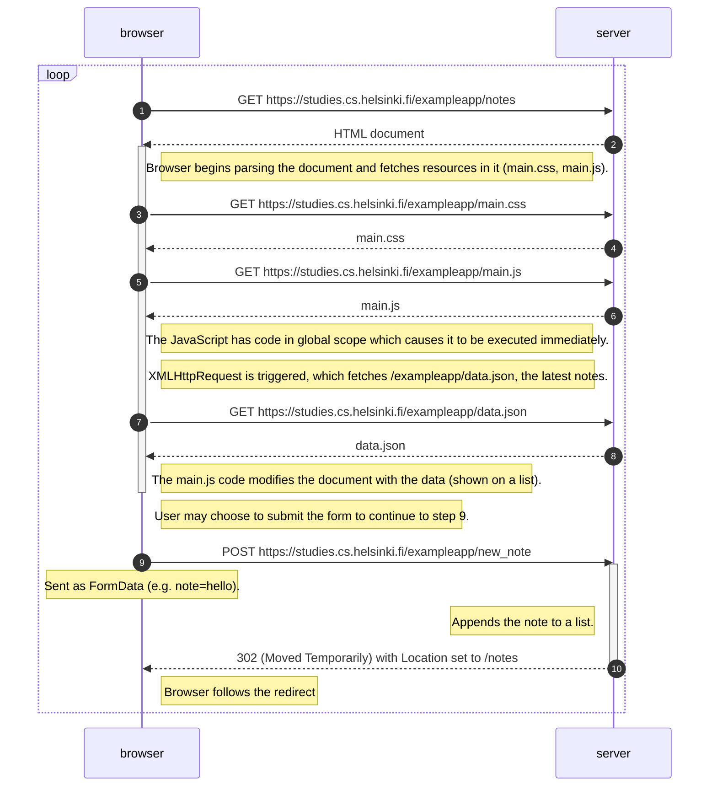
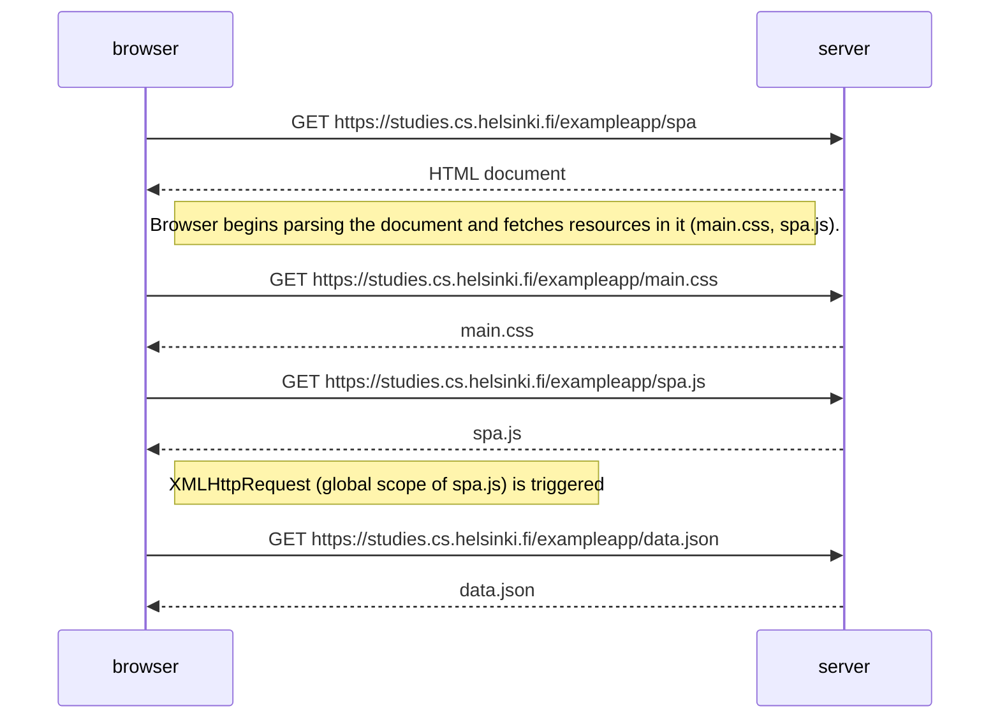
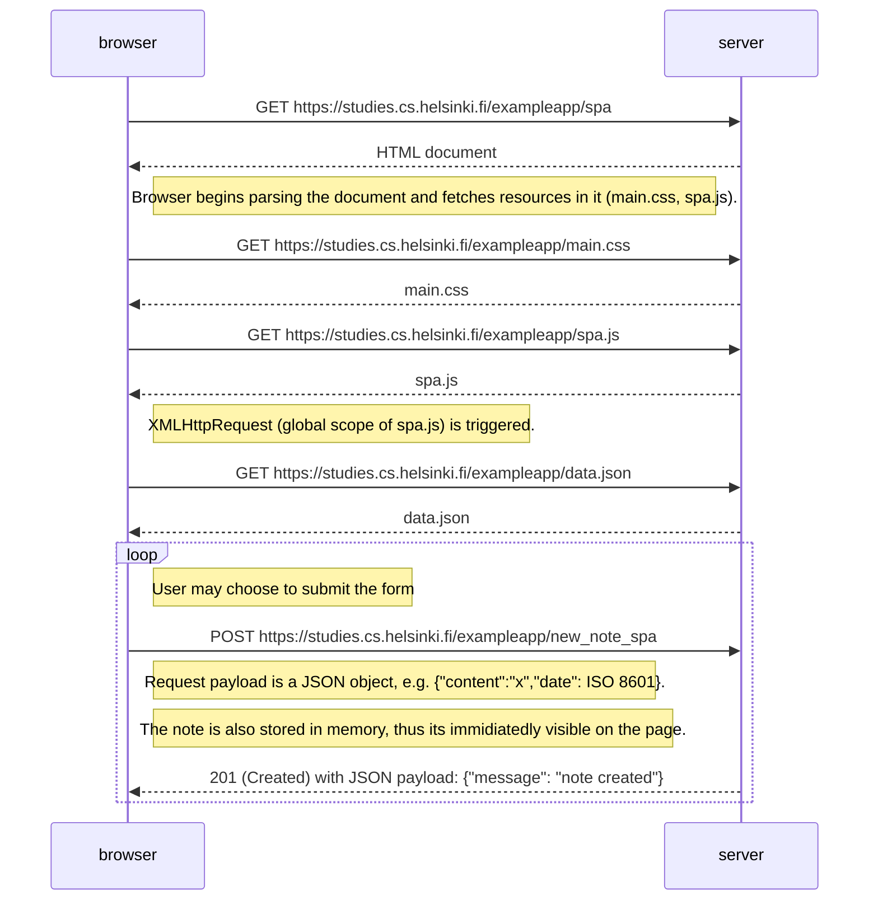

# Part 0 submissions

## 0.4

```mermaid
sequenceDiagram
    autonumber

    loop
    participant b as browser
    participant s as server

    b->>s: GET https://studies.cs.helsinki.fi/exampleapp/notes
    s-->>b: HTML document

    activate b
    Note right of b: Browser begins parsing the document and fetches resources in it (main.css, main.js).

    b->>s: GET https://studies.cs.helsinki.fi/exampleapp/main.css
    s-->>b: main.css

    b->>s: GET https://studies.cs.helsinki.fi/exampleapp/main.js
    s-->>b: main.js

    Note right of b: The JavaScript has code in global scope which causes it to be executed immediately.
    Note right of b: XMLHttpRequest is triggered, which fetches /exampleapp/data.json, the latest notes.

    b->>s: GET https://studies.cs.helsinki.fi/exampleapp/data.json
    s-->>b: data.json

    Note right of b: The main.js code modifies the document with the data (shown on a list).

    deactivate b

    Note right of b: User may choose to submit the form to continue to step 9.

    b->>s: POST https://studies.cs.helsinki.fi/exampleapp/new_note
    activate s
    Note over b: Sent as FormData (e.g. note=hello).
    Note left of s: Appends the note to a list.
    s-->>b: 302 (Moved Temporarily) with Location set to /notes
    deactivate s

    Note right of b: Browser follows the redirect
    end
```

Steps 6—8 are not required to submit the form. Submitting works without JavaScript enabled.

## 0.5

```mermaid
sequenceDiagram
    participant b as browser
    participant s as server

    b->>s: GET https://studies.cs.helsinki.fi/exampleapp/spa
    s-->>b: HTML document

    Note right of b: Browser begins parsing the document and fetches resources in it (main.css, spa.js).
    b->>s: GET https://studies.cs.helsinki.fi/exampleapp/main.css
    s-->>b: main.css

    b->>s: GET https://studies.cs.helsinki.fi/exampleapp/spa.js
    s-->>b: spa.js

    Note right of b: XMLHttpRequest (global scope of spa.js) is triggered

    b->>s: GET  https://studies.cs.helsinki.fi/exampleapp/data.json
    s-->>b: data.json
```

## 0.6

```mermaid
sequenceDiagram
    participant b as browser
    participant s as server

    b->>s: GET https://studies.cs.helsinki.fi/exampleapp/spa
    s-->>b: HTML document

    Note right of b: Browser begins parsing the document and fetches resources in it (main.css, spa.js).
    b->>s: GET https://studies.cs.helsinki.fi/exampleapp/main.css
    s-->>b: main.css

    b->>s: GET https://studies.cs.helsinki.fi/exampleapp/spa.js
    s-->>b: spa.js

    Note right of b: XMLHttpRequest (global scope of spa.js) is triggered.

    b->>s: GET  https://studies.cs.helsinki.fi/exampleapp/data.json
    s-->>b: data.json

    loop
    Note right of b: User may choose to submit the form
    b->>s: POST https://studies.cs.helsinki.fi/exampleapp/new_note_spa
    Note right of b: Request payload is a JSON object, e.g. {"content":"x","date": ISO 8601}.
    Note right of b: The note is also stored in memory, thus its immidiatedly visible on the page. 
    s-->>b: 201 (Created) with JSON payload: {"message": "note created"}

    end
```

